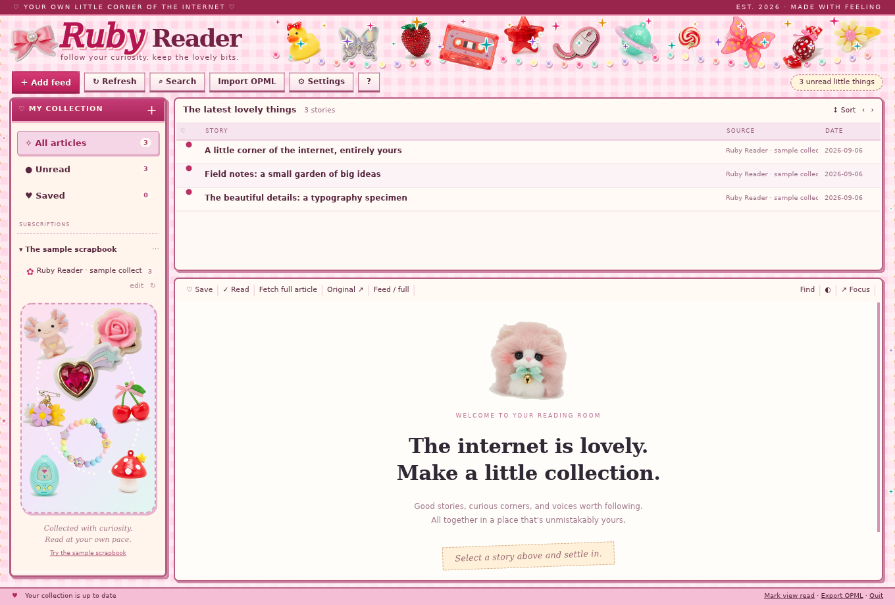

<h1 align="center">🎀 Ruby Reader</h1>

<p align="center"><em>A quiet place to read. An unreasonable number of accessories.</em></p>

Ruby Reader is a native RSS reader with a Decora heart: pink gingham, glossy
charms, plush little friends, and a fondness for the wonderfully over-decorated
web of the ’90s. The frame gets the glitter. Your articles get room to breathe.



## ♡ Inside the reading room

- **Bring your favorite corners of the internet.** Follow RSS, Atom, and JSON
  feeds; discover feeds from website addresses; organize folders; import and
  export OPML.
- **Keep the lovely bits.** Search your collection, save stories with a heart,
  and pick up where you left off. Saved articles stay even if a feed goes away.
- **Settle into a proper article.** Images, tables, code, figures, and footnotes
  have a home here. Enlarge images, find a passage, or fetch the full text of a
  public article when its feed only offers a nibble.
- **Make yourself comfortable.** Light, sepia, and dark themes for the whole app;
  adjustable type and spacing; resizable panes; keyboard and mouse shortcuts; and
  a Focus mode for getting lost in a good story.
- **Poke the accessories.** Each launch picks a fresh, non-repeating arrangement
  from 29 decorations. Click a charm for a little wiggle and a sparkle burst.
  Reduced Motion keeps things calm.
- **Tuck it into the tray.** Closing the window keeps feeds refreshing in the
  background. Click the tray icon to return; choose Quit to put everything away.

No hosted account, no telemetry, no recommendation algorithm. Your library lives
on your machine; Ruby Reader connects to the feeds and article sites you use.

## 🧵 A little assembly required

This is an early, Linux-first project written in Rust. Its native reading surface
uses **TRust**, not a browser webview; artwork and fonts travel inside the binary.
Linux ARM64 is the platform tested so far.

**For now, building needs the matching active `TRust` and `Lumen` source checkouts
beside `RubyReader`.** TRust must include the reader's `embed` API and local engine
changes; this repository alone is not yet a self-contained build.

With those siblings in place:

```sh
cargo build --release --locked -p ruby-reader
./target/release/ruby-reader --sample
```

The optional `--sample` flag opens a little local scrapbook to explore. Leave it
off to start with your own feeds. **Add feed** accepts a feed or website address;
the **?** button introduces the controls and keyboard shortcuts.

The desktop uses a StatusNotifierItem-compatible tray, the desktop portal for
file picking, and `xdg-open` for external links. Without a working tray, the
window stays accessible. [Packaging helpers](packaging/README.md) are included
for local builds; they do not enable autostart.

## 💌 Keep your collection safe

Your library lives in `$XDG_DATA_HOME/ruby-reader`, falling back to
`~/.local/share/ruby-reader`. Quit Ruby Reader before backing up that directory.
OPML carries subscriptions, not your saved articles or reading history, and
**may include private feed tokens**—keep those exports private.

## ✨ From the craft table

Original charm artwork was generated locally with Ideogram, then cropped,
transparency-checked, and dressed up with native animation. The
[source art and preparation script](assets/source/) are included. Bundled DejaVu
fonts keep the reading room consistent; their [credits and license](assets/fonts/)
come along too.

<p align="center">Made with Rust, ribbons, and a soft spot for RSS. ♡</p>
